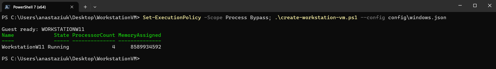
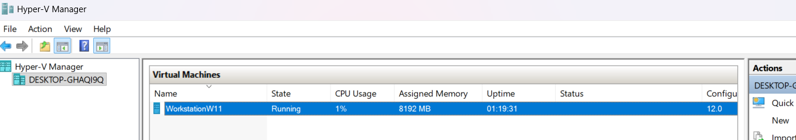

# WorkstationVM

Minimal Windows 11 Hyper-V workstation VM setup.

The script can download the Windows ISO automatically. You can also download the ISO yourself and set `windowsIsoPath` in `config\windows.json` before running the script.

## Requirements

- Windows host with Hyper-V support. Hyper-V requires Windows 10/11 Professional, Enterprise or Education according to [Microsoft's Hyper-V setup docs](https://learn.microsoft.com/virtualization/hyper-v-on-windows/quick-start/enable-hyper-v).
- Virtualization enabled in BIOS/UEFI. This is usually named Intel VT-x, Intel Virtualization Technology, AMD-V or SVM.
- Windows PowerShell 5.1 or newer. PowerShell 7+ is recommended, but the scripts also support the stock Windows PowerShell 5.1 that ships with Windows.
- Internet access for Windows ISO download, unless `windowsIsoPath` points to an existing local ISO.

## What It Does

- Downloads a Windows 11 ISO if `windowsIsoPath` is empty.
- Creates a bootable unattended Windows install ISO with built-in Windows APIs.
- Creates a Generation 2 Hyper-V VM.
- Sets the VMConnect display size from `displayWidth` and `displayHeight`, or from the host primary display when they are empty.
- Enables Hyper-V Enhanced Session transport for VMConnect.
- Installs Windows with an unattended local admin account.
- Keeps the workstation account signed in automatically after boot.
- Disables guest sleep, hibernation, display timeout, screensaver lock and idle session lock.
- Installs VS Code, Git, WireGuard, Tor Browser, Chrome, Outlook, Visual Studio Community 2026 with the C++ desktop workload, CMake, Python 3, TortoiseGit and ThinLinc Client on first login.
- Adds desktop shortcuts for common GUI tools.
- Enables the RDP server during first login.
- Writes an `.rdp` shortcut file on the host for double-click RDP access.
- Tunes the guest RDP/DWM frame interval and power plan for smoother interactive sessions.
- Creates a second dynamic data disk, formats it as `W:` and enables BitLocker on it.
- Generates an SSH key and enables OpenSSH Server inside the VM for the workstation user.
- Waits until the guest finishes bootstrap and is ready to use.
- Can enable GPU-PV during creation so the VM receives a partition of a compatible host GPU.
- Can install Sunshine and Virtual Display Driver so Moonlight clients can connect to the VM at more than 60 FPS.

## Important Settings

- Network uses Hyper-V `Default Switch`, which is NAT.
- Do not change the VM to an external or bridged switch unless that is intentional.
- Keep VPN profiles, work accounts and work browser sessions inside the VM.
- Host traffic is separate from VM traffic. The VM gets its own NATed network path.
- Hyper-V Enhanced Session is enabled for local VMConnect use.
- The VM is intentionally configured as an always-open workstation session unless it is locked manually.
- Secure Boot and TPM are enabled.
- A separate BitLocker-protected data disk is created for confidential files.
- Dynamic memory and automatic checkpoints are disabled.
- No checkpoints are created by default.
- GPU-PV is controlled by `gpu.enabled` in `config\windows.json`.
- Moonlight streaming is controlled by `remoteStreaming.enabled` in `config\windows.json` and exposes Sunshine only on the VM network.

## Prepare Host

Run once from PowerShell **as Administrator**:

```powershell
Set-ExecutionPolicy -Scope Process Bypass; .\prepare-host.ps1
```

This validates BIOS/UEFI virtualization setup, enables Hyper-V, installs the Windows OpenSSH client if needed, enables Hyper-V Enhanced Session Mode and adds the current user to `Hyper-V Administrators`.

If virtualization is disabled in BIOS/UEFI, the script stops before changing the VM setup. Enable Intel VT-x, Intel Virtualization Technology, AMD-V or SVM in BIOS/UEFI, restart Windows, then run the prepare step again.

**IMPORTANT: RESTART WINDOWS AFTER RUNNING `prepare-host.ps1` AS ADMINISTRATOR.**

Closing the Administrator PowerShell window is not enough. Windows only refreshes the current user's `Hyper-V Administrators` group membership on a new login session. A sign-out/sign-in is usually enough for that group refresh, but a full restart is the safest option and is required when Windows has just enabled Hyper-V features. If you skip this step, the create script can fail later at `New-VHD` with a missing privileges error.

After restarting or signing back in, open a new PowerShell session **without Administrator privileges**.

## Run

Run from normal PowerShell **without Administrator privileges**:

```powershell
Set-ExecutionPolicy -Scope Process Bypass; .\create-workstation-vm.ps1 --config config\windows.json
```

Before running the script, open `config\windows.json` and make sure the VM name, disk sizes, RAM, CPU count and install paths match the host PC. The default config creates a VM with 4 vCPU, 8 GB RAM, a 128 GB OS disk and a 64 GB BitLocker data disk.

To place the VM files and Windows ISO cache on another disk, set paths like:

```json
"baseDir": "D:\\VMs\\WorkstationWindows11",
"imageCacheDir": "D:\\VMs\\_image-cache\\windows"
```

This also works on ReFS volumes, including Windows Dev Drive.

Edit `config\windows.json` first if you want a different VM name, RAM, CPU count, disk size or install path. `vmName` is also used as the Windows computer name inside the guest, so keep it at 15 characters or fewer.
By default, an existing VM or disk is not deleted. Set `recreate` to `true` only when you intentionally want to replace it.

The default config enables GPU-PV and Moonlight streaming. If you do not want the VM to receive a host GPU partition, set this before running the create script:

```json
"gpu": {
  "enabled": false
}
```

If you also do not want Sunshine and Virtual Display Driver installed for Moonlight streaming, disable the streaming stack too:

```json
"remoteStreaming": {
  "enabled": false
}
```

Disabling only `gpu.enabled` skips the Hyper-V GPU partition and guest GPU driver copy. Disabling `remoteStreaming.enabled` skips Sunshine, Virtual Display Driver and the Moonlight firewall rules.

The generated login is written to:

```text
$HOME\VMs\WorkstationWindows11\credentials.txt
```

The file contains the VM username, password and data disk BitLocker password. VMConnect should reconnect to the already unlocked local session after the guest boots. Use this login for Hyper-V Connect, RDP, PowerShell Direct or manual sign-in when needed.
When Moonlight streaming is enabled, the same file also contains the Sunshine web UI login, Moonlight host address and Sunshine web UI URL.
Print it from PowerShell with:

```powershell
Get-Content -LiteralPath "$HOME\VMs\WorkstationWindows11\credentials.txt"
```

When the script finishes successfully, the VM is ready to use and the output looks like this:



If `check-workstation-vm.ps1` reports power or lock policy drift, repair the running VM without deleting or recreating it:

```powershell
.\set-workstation-session-policy.ps1 --config config\windows.json
.\check-workstation-vm.ps1 --config config\windows.json
```

Open Hyper-V Manager, then double-click the VM to open the interactive VM window. Hyper-V Connect, RDP and Moonlight are all supported so you can use whichever connection path fits the current workflow:



Check the VM:

```powershell
.\check-workstation-vm.ps1 --config config\windows.json
```

## Changing VM Settings

`config\windows.json` is used when the VM is created. After the VM exists, you can change normal Hyper-V settings without recreating it.

Use Hyper-V Manager for changes like CPU count, memory, display size or disk expansion. Some changes require the VM to be shut down first. Keep `recreate` set to `false` unless replacing the VM and its disk is intentional.

## BitLocker Data Disk

The setup creates a second dynamic data disk by default:

- Drive letter: `W:`
- Initial maximum size: 64 GB
- File system label: `WorkData`
- BitLocker: enabled with used-space-only encryption

Use this disk for confidential work files such as VPN profiles, VPN configs, client-provided documents or other sensitive working data.

The BitLocker password is generated during bootstrap and written to `credentials.txt` under `baseDir`. After a VM restart, unlock the disk from Windows Explorer or with:

Treat `credentials.txt` as sensitive. Move the BitLocker password to a password manager and remove the local copy if the VM folder may be shared or copied.

```powershell
$password = Read-Host "BitLocker password" -AsSecureString
Unlock-BitLocker -MountPoint W: -Password $password
```

The data disk is a dynamic VHDX. It can be expanded later without recreating the VM. Shut down the VM, resize the VHDX on the host, start the VM, then extend the partition inside Windows:

```powershell
Resize-VHD -Path "$HOME\VMs\WorkstationWindows11\vm\WorkstationW11-data.vhdx" -SizeBytes 128GB
```

Inside the VM:

```powershell
$size = Get-PartitionSupportedSize -DriveLetter W
Resize-Partition -DriveLetter W -Size $size.SizeMax
```

## Default Software

The first-login bootstrap installs these tools inside the VM by default:

- VS Code
- Git
- WireGuard
- Tor Browser

It also enables the RDP server, Remote Desktop firewall rules and RDP access for the workstation user.
It also enables OpenSSH Server and installs the generated SSH public key for the workstation user.
Remote Desktop frame pacing is tuned during bootstrap so VMConnect Enhanced Session and RDP do not use the default 30 FPS cap. The target is stable 60 FPS for remote sessions.

## SSH

The setup generates an SSH key pair under `baseDir`:

- Private key: `ssh_key_ed25519.key`
- Public key: `ssh_key_ed25519.key.pub`

The public key is installed inside the VM for the workstation admin user. The private key stays on the host next to `credentials.txt`.

For long-lived keys, consider using a password manager with an SSH agent. For example, 1Password can serve keys through its SSH agent so a private key does not need to stay as a plain file on the filesystem.

Get the VM IP address from PowerShell:

```powershell
Get-VMNetworkAdapter -VMName WorkstationW11 | Select-Object -ExpandProperty IPAddresses
```

Connect from the host:

```powershell
ssh -i "$HOME\VMs\WorkstationWindows11\ssh_key_ed25519.key" work@<vm-ip>
```

## Display Performance

The bootstrap tunes the VM for stable 60 FPS VMConnect Enhanced Session and RDP use instead of the default 30 FPS behavior.

The guest also disables automatic sleep, hibernation, display power-off, screensaver lock, idle lock and RDP idle/disconnect time limits. BitLocker on the data disk remains separate and still requires the generated data disk BitLocker password after a guest restart.

Higher refresh rates are not expected through the standard Hyper-V VMConnect or RDP path. Use the Sunshine/Moonlight path when `remoteStreaming.enabled` is on. GPU-PV gives the guest a partition of the host GPU, while Virtual Display Driver gives Sunshine a display mode that Moonlight can drive above 60 FPS.

## GPU-PV

GPU-PV can share part of a compatible host GPU with the VM. `create-workstation-vm.ps1` applies it when `gpu.enabled` is `true` in `config\windows.json`. You can also run the helper manually against an existing VM.

Edit `config\windows.json`:

The default allocation is conservative:

```json
"gpu": {
  "enabled": true,
  "gpuName": "AUTO",
  "allocationPercent": 25
}
```

Check compatibility without changing the VM:

```powershell
.\enable-gpu-pv.ps1 --config config\windows.json --check
```

Apply or update GPU-PV:

```powershell
.\enable-gpu-pv.ps1 --config config\windows.json
```

Running the script again updates the existing GPU-PV adapter allocation. For example, changing `allocationPercent` from `25` to `30` and running the script again updates the adapter instead of adding another one. Existing driver files are not refreshed while GPU-PV is active because the guest may have them loaded.

Disable GPU-PV:

```powershell
.\enable-gpu-pv.ps1 --config config\windows.json --disable
```

The helper asks the guest to shut down cleanly through PowerShell Direct, copies the current host GPU driver files into the guest system disk, configures the Hyper-V GPU partition adapter, then restarts the VM if it was running before. It does not force power off, delete or recreate the VM.

GPU-PV is hardware and driver dependent. After updating the host GPU driver, disable GPU-PV, boot the VM once without it, then apply GPU-PV again so the guest receives a fresh driver copy. If the guest display or GPU driver behaves badly, run the helper with `--disable`.

## Optional Debloat

After the VM is installed, you can optionally use tools such as [undergroundwires/privacy.sexy](https://github.com/undergroundwires/privacy.sexy) to review and apply Windows privacy or debloat tweaks.

This is not part of the bootstrap. Review any selected tweaks before applying them because debloat tools can disable Windows features that some workflows need.

## Windows Activation

This setup does not automate Windows activation. Activate the VM after installation with a valid Windows license, product key or organization-provided activation method.

Unofficial activation tools are outside the scope of this setup. They bypass official licensing and can create audit or compliance risk for business use.

**Win 11 PRO VM inside a Win 11 PRO Host does indeed need 2 separate windows licenses as per the EULA!**

## VPN

If a customer provides a VPN profile or config, import and enable it inside this VM only. Do not enable customer VPN profiles on the host.

The default Hyper-V network uses NAT, so host traffic and VM traffic stay on separate network paths.

When this VM is used as a ProxyJump bastion, keep SSH identities on the host PC. The workstation VM only runs the customer VPN and opens the target-side TCP connection. The host SSH client authenticates to both the jump VM and the customer target using host-side private key files or a host-side SSH agent.

## RDP

The VM enables the RDP server, Remote Desktop firewall rules and RDP access for the workstation user during first login.

The create script writes an RDP shortcut on the host:

```text
$HOME\VMs\WorkstationWindows11\WorkstationW11.rdp
```

Double-click that file to connect with `mstsc.exe`. The file contains the current VM IP and username, but it does not store the VM password. If the VM IP changes, refresh the file manually:

```powershell
.\write-rdp-file.ps1 --config config\windows.json
```

If you want to use RDP as the main UI, consider checking out [Upinel/BetterRDP](https://github.com/Upinel/BetterRDP) and applying its `.reg` file **on the host, not inside the VM**. It tunes the RDP experience by enabling GPU/RemoteFX policies, 60 FPS capture/DWM settings, AVC444/hardware encode preference, image quality, latency and bandwidth-related registry settings. This is optional and is not vendored here.

## Moonlight Streaming (OPTIONAL if you want more than 60 FPS)

The default `config\windows.json` enables a local Sunshine endpoint for Moonlight:

- Sunshine is installed as a Windows service inside the VM.
- Virtual Display Driver is installed inside the VM and configured with one virtual display.
- Sunshine firewall rules are opened for the VM network.
- Sunshine credentials and the current VM IP are written to `credentials.txt`.
- GPU-PV is applied after Windows bootstrap when `gpu.enabled` is `true`.
- Empty `remoteStreaming.displayWidth` and `remoteStreaming.displayHeight` use the same detected host display size as VMConnect.

The setup installs the Sunshine server inside the VM. To use Moonlight from the Hyper-V host:

1. Download and install the Moonlight Windows installer on the host from https://github.com/moonlight-stream/moonlight-qt/releases.
2. Open Moonlight settings before starting the stream and use desktop-quality settings:
   - Resolution: `Native`, or the same resolution as the VM virtual display.
   - FPS: `120 FPS`.
   - Video bitrate: at least `100 Mbps` for host-to-VM streaming on the same PC.
   - Display mode: `Fullscreen`.
   - Frame pacing: enabled.
   - Optimize mouse for remote desktop instead of games: enabled.
   - Video decoder and video codec: `Automatic`.
3. Do not leave Moonlight at its default `720p` and low bitrate settings. That makes the VM look blurry because Moonlight upscales a low-resolution stream.
4. If Moonlight auto-discovers the VM, click the locked VM tile. If it does not show up automatically, add the VM IP from `MoonlightHost` manually.
5. When Moonlight shows a PIN, submit it from the host:

```powershell
.\pair-moonlight.ps1 --config config\windows.json --pin <moonlight-pin> --name <client-name>
```

After pairing, click the VM tile again and start `Desktop`. If the image is blurry, stop the stream, re-check Moonlight's resolution and bitrate settings, then start `Desktop` again. Enable Moonlight's performance stats when troubleshooting and confirm that the stream is negotiated at the expected resolution and FPS.

Open the Sunshine web UI if you want to inspect or tune it:

```text
https://<vm-ip>:47990
```

The Sunshine username and password are in `credentials.txt`. Keep them private. Use Moonlight's client settings to request 120 FPS or another refresh rate.
